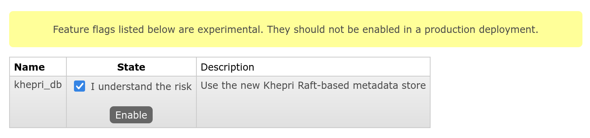

# Enabling Khepri

Mnesia is still the default metadata store backend. Khepri has to be
explicitly enabled using the `khepri_db` feature flag.

This page demonstrates how to enable Khepri in various situations and what the
user should be aware of.

:::warning
Khepri is an experimental feature in RabbitMQ. It may be unslable and/or slow
for your workload. Furthermore, we may introduce breaking changes that prevent
an in-place upgrade if Khepri is enabled.

Therefore at this stage, **Khepri is not recommended in production**.
:::

## On a brand new RabbitMQ node

### Using the CLI

1.  Start the new RabbitMQ node using a method of your choice. The example
    below executes the [`rabbitmq-server(8)` command](../man/rabbitmq-server.8)
    directly:

    ```
    rabbitmq-server
    ```

    At that point, the **node is using Mnesia** as the metadata store backend.

2.  Enable the `khepri_db` feature flag:

    ```
    rabbitmqctl enable_feature_flag --experimental khepri_db
    ```

See the next page to learn more about what happens when nodes with Mnesia and
nodes with Khepri are clustered together.

### Using the management UI

1.  Start the new RabbitMQ node using a method of your choice. See [the
    example above](#using-the-cil).

    At that point, the **node is using Mnesia** as the metadata store backend.

2.  Enable the [management plugin](../management):

    ```
    rabbitmq-plugins enable rabbitmq_management
    ```

3. Open and log into the [management UI](../management#usage-ui).

4. Navigate to *"Admin > Feature Flags"*.

5. Tick *"I understand the risk"* and click the *"Enable"* button:

    <figure>
    
    <figcaption>The experimental feature flags section in the management
    UI</figcaption>
    </figure>

### Using an environment variable

You can set the `$RABBITMQ_FEATURE_FLAGS` environment varable to set the list
of feature flags to enable at boot time on a new node. The variable must be
set to the exhaustive list of feature flags to enable on this node. This
variable is considered on the very first boot only; it is ignored afterwards.

:::warning
The use of this variable requires some caution: because the variable takes an
exhaustive list, you must be careful to leave a feature flag disabled that
shoult have been enabled during the first boot otherwise.
:::

Start the new RabbitMQ node using a method of your choice, setting the
`$RABBITMQ_FEATURE_FLAGS` variable in the process. The example below executes
the [`rabbitmq-server(8)` command](../man/rabbitmq-server.8) directly:

```
env RABBITMQ_FEATURE_FLAGS=khepri_db,... rabbitmq-server
```

Note that this example does not list other feature flags to keep it short:
you need to fill that list.

The RabbitMQ node will use Khepri right from the beginning.

## On an existing standalone node or cluster

You can enable Khepri while the entire cluster is running and healthy, like
any other feature flag. In fact you can’t enable it while a node or the entire
cluster is stopped.

To enable Khepri, you can use either the [CLI command](#using-the-cli) on the
[management UI](#using-the-management-ui) methods described above.

The migration of the existing data from Mnesia to Khepri runs in parallel of
regular activities of RabbitMQ. However this migration takes resources and
will pause other activities near the end of the process for a short period of
time. Therefore, perform this migration away from peek load.
